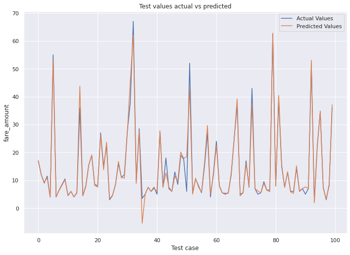

# Taxi Price Prediction

## Foreword

The aim of this project was to perform and present a data science project from an academic perspective. Mainly predicted price of taxi fare gives several parameters like:- 
1.   Passenger Count
2.   Trip Distance
3.   Payment Type
4.   Fare Amount
5.   Extra
6.   MTA Tax
7.   Tip Amount
8.   Tolls Amount
9.   Imporvement Surcharge
10.  Total Amount
11.  Day Of Week Num
12.  Fare time in hours
13.  Month Day Num, etc.

A breif overview of the various techniques used in this project have been included in the ipnyb file. Latex has been used for mathematical notations where needed. Due to the academic nature of the project, the graphs too have been properly designed and labeled. Due to the categorical nature of the attributes, decided to focus mainly on decision tree based algorithms. The models have been carefully tested using various techniques described below to prevent any overfit or underfit. 

## Results
 After trying various regression methods including Linear Regression, Decision trees, CAT Boosting, etc. Xgboost gave us the best result with training accuracy of **99.67%** and testing accuracy of **96.9%**.
 

  

